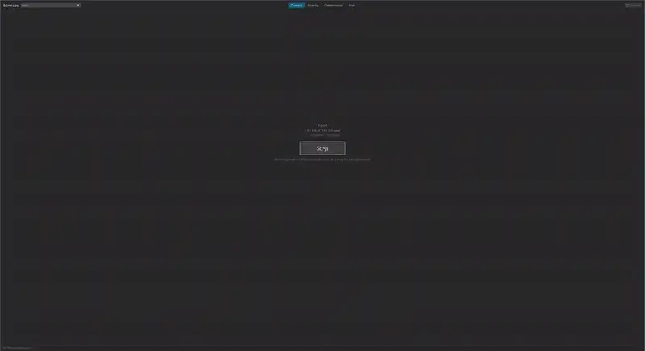

# btrmaps

btrmaps lays a btrfs filesystem out along a Hilbert curve, where neighbouring
pixels are neighbouring bytes, and samples it live, one lookup per pixel on
screen, so you can zoom from the whole disk down to single blocks while it fills
in.



Each color is a set of files that own those bytes. Data shared through snapshots,
reflinks or hardlinks gets its own color instead of being counted once per file.

There are four modes:

- Owners: the set of files that own each region.
- Sharing: how many files share each region.
- Compression: the compression ratio btrfs records for each extent.
- Age: when each extent was written.

## Install

Requires Linux, btrfs, Wayland or X11, and `sudo`.

- Release binaries for x86_64 and aarch64 are on the
  [releases page](https://github.com/joshheinrichs/btrmaps/releases). They need
  glibc 2.35 or newer.
- Nix: `nix run github:joshheinrichs/btrmaps`, or `nix-build`, which builds
  `result/bin/btrmaps`. `default.nix` takes a `pkgs` argument if you want to use
  your own nixpkgs.
- Cargo: `cargo install --git https://github.com/joshheinrichs/btrmaps`

## Usage

```
btrmaps
```

Pick a filesystem, press Scan and enter your password. Scroll to zoom and drag to
pan. Hovering shows the files under the pointer. Click a set to highlight it, or
hold Shift to highlight whatever is under the pointer. Right-click to copy a path,
open its folder, or move it to the trash.

The window doesn't run as root. It starts a helper, `btrmaps scan`, through
`sudo`; the helper reads the filesystem's trees and answers which files own a
given position on disk.

## Background

The layout comes from Farid Zakaria's
[Visualizing Nix closures](https://fzakaria.com/2026/09/15/visualizing-nix-closures),
which puts the bytes of Nix store paths on a Hilbert curve. The way bytes are
attributed to files comes from [btdu](https://github.com/CyberShadow/btdu): look
up what is at a disk position with `LOGICAL_INO` and attribute shared extents to
every file that references them.

<details>
<summary>How it works</summary>

The map is split into 256×256 tiles at several zoom levels, each twice the
resolution of the one above, down to one pixel per 4 KiB. On a Hilbert
curve an aligned square is a contiguous range of bytes, so a tile only needs
redrawing when new information arrives for its range.

The window sends the helper the positions of on-screen pixels that don't have an
answer yet, coarser levels first. The helper answers each position with the whole
extent, free range or metadata chunk containing it, which usually covers many
pixels. A pixel without its own answer shows its parent's.

A quarter of the requests, and all of them once the visible area is done, go to
an evenly spaced grid over the whole disk. The sizes in the side pane are
estimated from that grid. Unlike btdu, which samples at random, the grid is fixed,
so the same disk gives the same picture.

Tiles store set ids and compression and age codes rather than colors. The GPU
turns them into colors with a lookup table, so changing modes doesn't redraw any
tiles.

</details>

## Credits

- [btdu](https://github.com/CyberShadow/btdu) by Vladimir Panteleev, a sampling
  disk usage profiler for btrfs. btrmaps uses the same method to find which files
  own a disk position, including shared, unreachable and compressed extents.
- [Visualizing Nix closures](https://fzakaria.com/2026/09/15/visualizing-nix-closures)
  by Farid Zakaria ([seenix](https://github.com/fzakaria/seenix)), the Hilbert
  curve layout btrmaps is based on.
- [Visualising binaries](https://corte.si/posts/visualisation/binvis/) by Aldo
  Cortesi ([binvis.io](https://binvis.io)), earlier work on Hilbert curves for
  binary data, which seenix credits.

## Development

`nix-shell` (or `nix develop`) provides the pinned toolchain and the libraries
`cargo run` needs to open a window. `cargo test` runs the unit tests.

`nix-build -A tests.e2e` (or `nix flake check`) runs the end-to-end test in a
NixOS VM with a btrfs disk containing snapshots, reflinks, hardlinks and
compressed files. It checks the helper's answers, then runs the app under sway and
saves screenshots to `result`.

CI runs both. Pushing a `v*` tag that matches the version in `Cargo.toml` builds
release binaries.

## License

Licensed under either of [Apache License, Version 2.0](LICENSE-APACHE) or
[MIT license](LICENSE-MIT), at your option.

Unless you explicitly state otherwise, any contribution intentionally submitted
for inclusion in btrmaps by you, as defined in the Apache-2.0 license, shall be
dual licensed as above, without any additional terms or conditions.
